<table>
<colgroup>
<col style="width: 21%" />
<col style="width: 78%" />
</colgroup>
<tbody>
<tr>
<td rowspan="2"></td>
<td style="text-align: center;">
<strong>Manuel utilisateur du plugin
« Jeux d’attributs génériques »</strong>

<strong>V0.1</strong>
</td>
</tr>
<tr>
<td style="text-align: center;"></td>
</tr>
</tbody>
</table>

<table style="width:100%;">
<colgroup>
<col style="width: 24%" />
<col style="width: 18%" />
<col style="width: 5%" />
<col style="width: 11%" />
<col style="width: 5%" />
<col style="width: 7%" />
<col style="width: 4%" />
<col style="width: 20%" />
</colgroup>
<thead>
<tr>
<th colspan="4" style="text-align: center;">Identifiant</th>
<th colspan="3" style="text-align: center;">Version</th>
<th style="text-align: center;">Date de création</th>
</tr>
</thead>
<tbody>
<tr>
<td colspan="4"></td>
<td colspan="3" style="text-align: center;"><strong>0.1</strong></td>
<td style="text-align: center;">18/11/2025</td>
</tr>
<tr>
<td>Rédacteur</td>
<td colspan="7">Gérôme PECHEUR</td>
</tr>
<tr>
<td><em>Entité émettrice</em></td>
<td colspan="7">DTSO</td>
</tr>
<tr>
<td>Diffusion</td>
<td colspan="2">□ Interne</td>
<td colspan="3">■ Ouverte</td>
<td colspan="2" style="text-align: center;">□ Limitée</td>
</tr>
<tr>
<td>Résumé</td>
<td colspan="7">Installation et utilisation du plugin</td>
</tr>
<tr>
<td>Approbateur</td>
<td></td>
<td colspan="3">Date d’approbation</td>
<td colspan="3" style="text-align: center;">18/11/2025</td>
</tr>
</tbody>
</table>

| Lecteur(s) |     |
|------------|-----|

| Version |    Date    | Modifié par    | Historique des modifications |
|:-------:|:----------:|----------------|------------------------------|
|   0.1   | 18/11/2025 | Gérôme PECHEUR | Création                     |

**Sommaire**

[1 Prérequis](#prérequis)

[2 Résumé](#résumé)

[3 Installation](#installation)

[4 Présentation](#présentation)

[5 Filtrage des champs](#filtrage-des-champs)

[5.1 Sélection unique / multiple](#sélection-unique-multiple)

[5.2 Sélection via 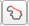](#sélection-via)

[6 Modification des valeurs des champs](#modification-des-valeurs-des-champs)

[7 Modification de l’ordre d’affichage des « widgets »](#modification-de-lordre-daffichage-des-widgets)

[8 Paramétrage des préférences de l’interface](#paramétrage-des-préférences-de-linterface)

[9 A propos](#a-propos)

# 

# Prérequis

Version de QGIS : 3.28 ou supérieur.

Ce plugin fonctionne en parallèle avec le plugin « maitre ».

# Résumé

Ce plugin est une aide à la modification des attributs des différents
champs.

Un filtre permet de sélectionner uniquement les champs que l’on veut
modifier.

# Installation

Au préalable il faut installer le plugin « Maitre », c’est lui qui gère
l’intégration du plugin dans le menu IGN et / ou dans les barres
d’outils. Sans lui le plugin « jeux d’attributs génériques » ne sera pas
accessible.

Le plugin « espace collaboratif » doit également être installé afin
d’impacter les modifications des couches vers les serveurs IGN, sinon
seules les données locales seront modifiées.

Ouvrir QGIS.

Allez dans **Extensions/Installer/Gérer les extensions**, cliquez sur
**Installer depuis un ZIP**, sélectionner le fichier ZIP puis cliquez
sur **Installer le plugin**.

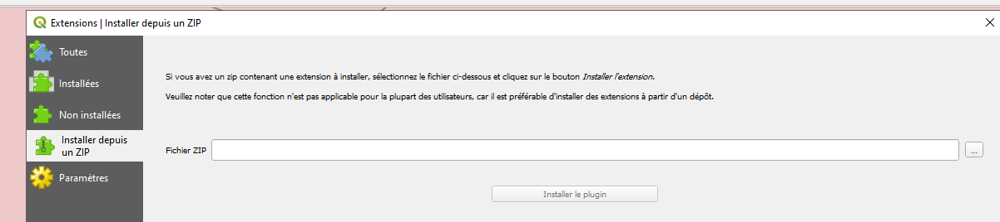

# Présentation

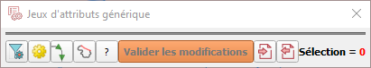

Lors de la première ouverture de l’interface, seul les boutons par
défauts apparaissent.

En effet le filtrage des champs est pour l’instant vide.

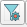  Permet de configurer le
filtrage des champs.

 Permet de paramétrer
l’interface (couleurs, nombre de boutons par ligne)

 Afficher / Masquer le sens
de numérisation des linéaires

 Permet de sélectionner
toutes les entités comprises entres deux linéaires en suivant
l’algorithme du « chemin le plus court »

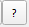 Permet d’afficher le suivi
des versions et d’ouvrir la documentation du plugin.

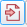 Permet d’importer une
configuration des filtres des champs.

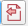 Permet d’exporter la
configuration des filtres des champs

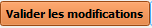 Permet de valider les
modifications dans QGIS. Les modifications vers le serveur IGN seront
effectives uniquement après avoir enregistré les modifications de la
couche via :

**ATTENTION :** ne pas confondre avec
l’enregistrement du projet : 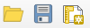

# Filtrage des champs

A la première ouverture le plugin n’affiche aucuns widgets, ceux-ci
doivent être configurés.

- Soit initialement avec un fichier de paramétrage fourni, que l’on peut
  modifier par la suite

- Soit en configurant manuellement les champs à modifier.

Cliquez sur 

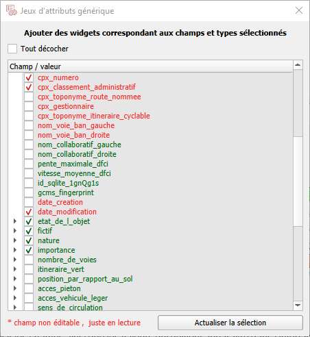

Cette interface permet de choisir les champs ainsi que les valeurs qui
doivent apparaitre dans l’interface principal pour pouvoir les modifier
par la suite.

En rouge : les champs ne sont pas modifiables, on peut les ajouter juste
pour consultation.

Les champs qui ne peuvent pas se « dérouler » correspondent à des
widgets « zone de texte »

Important : pour les champs « déroulables », ne pas oublier de
sélectionner également une ou plusieurs valeurs.

On actualise l’interface principal avec le bouton « actualiser la
sélection »

## Sélection unique / multiple

Lorsque l’on sélectionne une ou plusieurs entités, l’interface met :

- En vert : les attributs communs à chaque champ pour toutes les entités
  sélectionnées.

- En grisé : les valeurs en lecture seules

- Sans couleur : les valeurs qui ne sont pas communes à toutes les
  entités sélectionnées

> 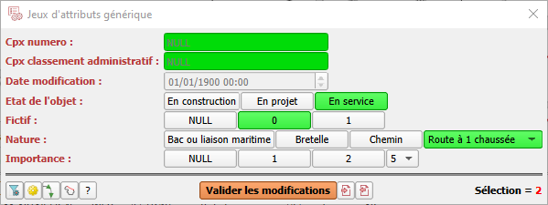 style="width:4.15924in;height:1.56543in" />

## Sélection via 

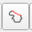 Ce bouton permet la
sélection de toutes les entités comprises entre 2 linéaires
sélectionnés.

Il faut sélectionner 2 tronçons. Ces 2 tronçons doivent être visibles à
l’écran et être connectés. Ensuite on clique sur
, le résultat est une
sélection de tous les tronçons entre le premier et le deuxième
sélectionnés respectant l’algorithme du chemin le plus court. Un
contrôle visuel est toutefois nécessaire afin de vérifier si la
sélection faite est celle attendue.

# Modification des valeurs des champs

Une fois les tronçons sélectionnés il suffit de cliquer sur les
nouvelles valeurs choisies.

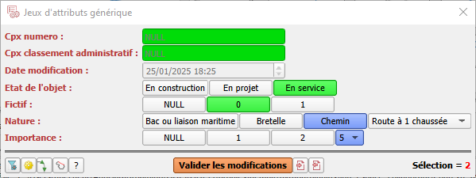

Les valeurs en lecture seules apparaissent en grisé et ne sont pas
modifiables.

Les valeurs à modifier sont affichées sur un fond bleu (par défaut).

Les modifications sur le(s) tronçon(s) sélectionné(s) sont à valider
avec le bouton 

Un message QGIS confirme la prise en compte des modifications.

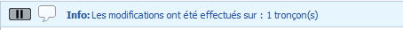

# Modification de l’ordre d’affichage des « widgets »

Apres filtrage des champs-valeurs il peut être pertinent de modifier
l’ordre d’affichage des différents « widgets » dans l’interface
principale.

Cela permet de gérer l’affichage des « widgets » en fonction des plus
utilisées.

Exemple :

Par défaut les « widgets » sont insérés par ordre d’affichage dans le
filtre.

On peut se retrouver avec un widget qui sera souvent utilisé mais qui
sera inséré dans la « combobox » ou dans un bouton mais pas à la
position voulue.

Solution :

Faire un clic-droit sur un « bouton » ou sur une valeur dans le
« combobox »

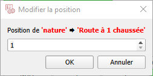

Renseigner la nouvelle position.

L’interface est mise à jour avec la nouvelle position du « widget ».

# Paramétrage des préférences de l’interface

 Ouvre l’interface de
paramétrage.

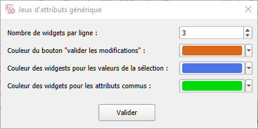

- Cette interface permet de configurer le nombre de « widgets » par
  ligne

Exemple : ici nous avons 3 « widgets » par ligne, cela signifie que si
on a sélectionné 5 valeurs différentes pour un champ (dans le filtrage),
dans l’interface principale nous auront les 3 premières valeurs sous
forme de « boutons » et les suivantes seront incluses dans une
« combobox » déroulante.

- On peut également modifier les couleurs des différents « widgets »

# A propos

Accessible via .

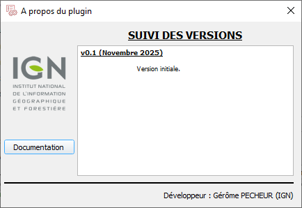

Ce dialogue permet de suivre l’historique
des différentes versions ainsi que d’afficher cette documentation.
